# CivicLens - Community Hero

**CivicLens** is a Google Cloud-deployed civic-resolution pilot for reporting, verifying, and reviewing hyperlocal community issues with Gemini-powered triage and human-governed decision checkpoints.

Live app: https://civiclens-py7ixxgroq-as.a.run.app

Submission doc: https://docs.google.com/document/d/19nFBVMLHUOqlKipMi7tsML25BW2h_Q2s82cQukuzlMk/edit?usp=sharing

Problem statement: **Community Hero - Hyperlocal Problem Solver**

> CivicLens is an independent civic pilot. It is not an official government portal and does not submit complaints externally.

## Why It Matters

Residents often report potholes, broken streetlights, water leaks, unsafe paths, and waste issues through fragmented channels. Reports may lack clear location context, duplicate awareness, closure evidence, and public status visibility. CivicLens turns those scattered reports into a structured, evidence-led workflow that communities and reviewers can trust.

## What Judges Can Try

- Submit a civic issue with a photo, location, and description.
- Let Gemini classify, summarize, translate, and prioritize the report.
- Review nearby duplicate handling and evidence-linking.
- Open a public issue detail page with a CivicLens Ticket ID.
- Use the synthetic operator desk to inspect server-owned agent traces and human approval gates.
- Open the dashboard for Open311 export, predictive hotspots, community leaderboard, and lifecycle metrics.
- Try Hindi in the public reporting flow.

## Core Features

- **Citizen field reporting** with camera/gallery upload, manual pin fallback, Google Places autocomplete, and responsive mobile flow.
- **Gemini multimodal triage** for category, urgency, severity, confidence, rationale, and citizen-facing summary.
- **Multilingual voice intake** using Gemini transcription, translation, category extraction, and readback.
- **Semantic duplicate control** with nearby candidate detection and evidence-linking instead of duplicate ticket spam.
- **Planner-first server agent workflow** with persisted `agentRuns` and `agentSteps`; the UI renders stored server records, not scripted traces.
- **SLA and follow-up workers** for escalation ladder, follow-up decisioning, and RTI-style PDF generation.
- **Ghost-closure forensics** comparing original, claimed closure, and fresh audit evidence before recommending reopen.
- **Trust economy and brigading guard** for weighted community confirmations, appeal state, and low-trust vote collapse.
- **Predictive hotspot worker** using Gemini to forecast ward-level risk patterns.
- **Open311 GeoReport export** for municipal interoperability.
- **Real outbound dispatch path** to a configured webhook, recorded with delivery receipt.
- **Public accountability ledger** for AI, citizen, operator, worker, and lifecycle events.
- **Weekly leaderboard and streaks** for civic participation while keeping the core workflow serious.

## Human Oversight

Gemini recommends; people decide. Human approval remains required for consequential workflow changes:

- duplicate merge
- routing or action-packet approval
- escalation finalization
- resolve
- reopen

Demo operator actions are server-limited to records explicitly marked as synthetic demo data. Real operator actions require server-authorized Firebase identity.

## Google Technologies

- **Gemini via `@google/genai`**: multimodal triage, structured output, voice intake, duplicate reasoning, closure forensics, predictive insights, and server-side workflow support.
- **Google Maps Platform**: map rendering and Places autocomplete for location context.
- **Firebase Auth**: anonymous citizen sessions and Google sign-in entry point.
- **Firestore**: issues, evidence metadata, approvals, support, verification, lifecycle fields, agent traces, leaderboard state, and audit events.
- **Firebase Storage**: report, evidence, and closure image storage governed by Storage Rules.
- **Firebase Admin SDK**: privileged server writes, transactions, role checks, counters, and lifecycle transitions.
- **Secret Manager**: runtime secrets for Cloud Run without committing secret values.
- **Cloud Run**: public production deployment.
- **Cloud Build and Artifact Registry**: build and container deployment pipeline.

## Architecture

CivicLens turns a citizen field report into a verified, human-reviewed civic case. Gemini recommends; the server validates; human reviewers approve consequential actions.

```mermaid
flowchart TD
  %% CivicLens judge-facing architecture graph

  A["Citizen uploads photo + location"] --> B["CivicLens Orchestrator<br/>Cloud Run + Express API"]

  B --> C["Visual Triage Agent<br/>Gemini multimodal analysis"]
  B --> D["Geocoding & Safety Agent<br/>Google Maps + Places"]
  B --> E["Duplicate Inspector<br/>Nearby cases + evidence comparison"]
  B --> F["SOP Planner Agent<br/>Draft action packet + next steps"]

  C --> C1["Identifies defects, category,<br/>severity, urgency, confidence"]
  D --> D1["Validates address, place,<br/>manual fallback, map context"]
  E --> E1["Deduplicates reports and<br/>links evidence to canonical case"]
  F --> F1["Generates routing draft,<br/>follow-up plan, closure checklist"]

  C1 --> G["Server-owned Firestore case record"]
  D1 --> G
  E1 --> G
  F1 --> G

  G --> H["Firebase Storage<br/>report + closure images"]
  G --> I["Community verification<br/>support • confirm • dispute"]
  G --> J["Persisted agent runs<br/>agentRuns + agentSteps"]

  J --> K["Operator workspace"]
  I --> K
  H --> K

  K --> L{"Human approval gate"}
  L -->|Approve route / escalation| M["In progress"]
  L -->|Request evidence| N["Needs more evidence"]
  L -->|Resolve or reopen| O["Final lifecycle decision"]

  M --> P["Citizen map dashboard"]
  N --> P
  O --> P

  P --> Q["Impact dashboard<br/>real records vs synthetic demo data"]

  subgraph Trust_Boundary["Trust boundary"]
    T1["Browser submits low-privilege report inputs"]
    T2["Server owns status, counters, approvals, traces"]
    T3["Firestore Rules block privileged client writes"]
    T4["Storage Rules restrict image uploads"]
    T5["Demo operator mutates synthetic cases only"]
    T6["No external government submission"]
  end

  B -. enforces .-> T2
  G -. protected by .-> T3
  H -. protected by .-> T4
  K -. constrained by .-> T5
  O -. respects .-> T6

  subgraph Google_Stack["Google stack"]
    GS1["Google AI Studio"]
    GS2["Gemini API"]
    GS3["Google Maps"]
    GS4["Google Places Autocomplete"]
    GS5["Firebase Auth"]
    GS6["Firestore"]
    GS7["Firebase Storage"]
    GS8["Secret Manager"]
    GS9["Cloud Build + Artifact Registry"]
    GS10["Google Cloud Run"]
  end

  B -. deployed on .-> GS10
  B -. secrets .-> GS8
  B -. built with .-> GS9
  C -. uses .-> GS2
  D -. uses .-> GS3
  D -. uses .-> GS4
  G -. stores in .-> GS6
  H -. stores in .-> GS7
  A -. signs in with .-> GS5
  B -. developed with .-> GS1

  classDef start fill:#111827,stroke:#f59e0b,color:#ffffff,stroke-width:2px;
  classDef orchestrator fill:#0f172a,stroke:#38bdf8,color:#ffffff,stroke-width:2px;
  classDef agent fill:#1f2937,stroke:#d1d5db,color:#ffffff,stroke-width:1.5px;
  classDef result fill:#374151,stroke:#9ca3af,color:#ffffff,stroke-width:1.2px;
  classDef data fill:#111827,stroke:#14b8a6,color:#ffffff,stroke-width:1.8px;
  classDef human fill:#172554,stroke:#60a5fa,color:#ffffff,stroke-width:1.8px;
  classDef decision fill:#3b1d08,stroke:#f59e0b,color:#ffffff,stroke-width:2px;
  classDef final fill:#052e2b,stroke:#2dd4bf,color:#ffffff,stroke-width:1.8px;
  classDef boundary fill:#451a03,stroke:#fb923c,color:#ffffff,stroke-width:1.4px;
  classDef google fill:#0c4a6e,stroke:#38bdf8,color:#ffffff,stroke-width:1.4px;

  class A start;
  class B orchestrator;
  class C,D,E,F agent;
  class C1,D1,E1,F1 result;
  class G,H,I,J data;
  class K human;
  class L decision;
  class M,N,O,P,Q final;
  class T1,T2,T3,T4,T5,T6 boundary;
  class GS1,GS2,GS3,GS4,GS5,GS6,GS7,GS8,GS9,GS10 google;
```



### Architecture Summary

- Frontend: React, TypeScript, Vite, Tailwind CSS.
- Backend: Express TypeScript server bundled with esbuild for Cloud Run.
- Data: Firestore plus Firebase Storage, guarded by Rules and Admin SDK boundaries.
- AI: Gemini-powered triage, drafting, reasoning, and server-side workflow support.
- Location: Google Maps and Google Places autocomplete.
- Deployment: Google Cloud Run with Secret Manager-backed runtime configuration.

Judge-facing materials:

- [Submission Google Doc](https://docs.google.com/document/d/19nFBVMLHUOqlKipMi7tsML25BW2h_Q2s82cQukuzlMk/edit?usp=sharing)
- [ARCHITECTURE.md](ARCHITECTURE.md)
- [security_spec.md](security_spec.md)
- [ATTRIBUTIONS.md](ATTRIBUTIONS.md)
- [LICENSE](LICENSE)
- [docs/AI_STUDIO_EVIDENCE.md](docs/AI_STUDIO_EVIDENCE.md)
- [docs/FINAL_EVIDENCE_REPORT.md](docs/FINAL_EVIDENCE_REPORT.md)

## Verified Deployment

- Public app URL: `https://civiclens-py7ixxgroq-as.a.run.app`
- Alternate Cloud Run URL: `https://civiclens-802067002365.asia-southeast1.run.app`
- Cloud Run service: `civiclens`
- Region: `asia-southeast1`
- Active revision: `civiclens-00059-245`
- Runtime image: `asia-southeast1-docker.pkg.dev/gen-lang-client-0871796745/civiclens/civiclens:d277989-public-20260630124658`
- Runtime app source: `main@d277989`

Latest public deploy smoke:

```text
DEPLOY_SMOKE_LIVE url=https://civiclens-py7ixxgroq-as.a.run.app ready=ready auth=ok gemini=ok maps=OK mapsApi=maps-javascript-places-bootstrap geminiTokens=32 mapsPredictions=0 durationMs=1770
```

## Verification Snapshot

Final completed checks:

- Broad headed Phase 0-6 verifier: all PASS; `consoleErrors=0`, `pageErrors=0`, `server5xx=0`.
- Deep phase-gap headed verifier: all PASS after Gemini cap increase; `consoleErrors=0`.
- `npx vitest run`: 131 passed, 11 skipped.
- `npm run test:e2e`: 7 browser release-gate tests passed.
- `npm run test:rules`: Firestore/Storage rules passed.
- `npm run test:concurrency`: transaction/concurrency tests passed.
- `npm run test:behavioral-api`: `authz=ok workerIdempotency=ok semanticDedup=ok`.
- `npm run test:golden-path`: duplicate merge, dispatch, ghost reopen, final resolution, Open311 export, predictive worker, and event ledger passed.
- `npm audit --omit=dev --audit-level=moderate`: 0 production vulnerabilities.

See [docs/FINAL_EVIDENCE_REPORT.md](docs/FINAL_EVIDENCE_REPORT.md) for the full evidence trail.

## Run Locally

```bash
npm ci
copy .env.example .env
npm run dev
```

Set real values in `.env` as needed:

- `GEMINI_API_KEY`
- `GOOGLE_MAPS_PLATFORM_KEY` or `VITE_GOOGLE_MAPS_PLATFORM_KEY`
- `VITE_FIREBASE_API_KEY`
- `VITE_FIREBASE_AUTH_DOMAIN`
- `VITE_FIREBASE_PROJECT_ID`
- `VITE_FIREBASE_APP_ID`
- `VITE_FIREBASE_STORAGE_BUCKET`
- `VITE_FIREBASE_MESSAGING_SENDER_ID`
- `VITE_FIREBASE_MEASUREMENT_ID`
- `FIREBASE_PROJECT_ID`
- `FIRESTORE_DATABASE_ID`
- `VITE_FIREBASE_APP_CHECK_SITE_KEY`
- `CIVICLENS_OPERATOR_EMAILS`
- `CIVICLENS_JOB_SECRET`

Vite reads `VITE_*` variables at build time. Rebuild the frontend after changing Firebase browser config, App Check site key, or Maps browser key.

The tracked `firebase-applet-config.json` is metadata-only and intentionally excludes Firebase API keys or service-account material.

Never commit `.env`, service-account JSON, API keys, tokens, or private credentials.

## Validation Commands

```bash
npm ci
npm run lint
npm test
npm run build
npm audit --omit=dev
npm run test:rules
npm run test:concurrency
npm run test:e2e
```

Additional live/evidence scripts:

```bash
npm run smoke:deploy
npm run test:behavioral-api
npm run test:golden-path
node scripts/verify-public-headed-phase-status.mjs
node scripts/verify-public-phase-gaps-headed.mjs
```

## Demo Boundary

The public deployment keeps judge access open:

- App Check support exists, but enforcement is relaxed for the hackathon demo.
- The public hackathon demo uses a conservative in-memory quota fallback to keep judge access open during repeated testing.
- Firestore-backed distributed quotas remain implemented and emulator-verified.
- Synthetic demo records are visibly labelled.

## License and Attributions

This project is licensed under the terms in [LICENSE](LICENSE). Third-party libraries, services, and demo image notes are listed in [ATTRIBUTIONS.md](ATTRIBUTIONS.md).
