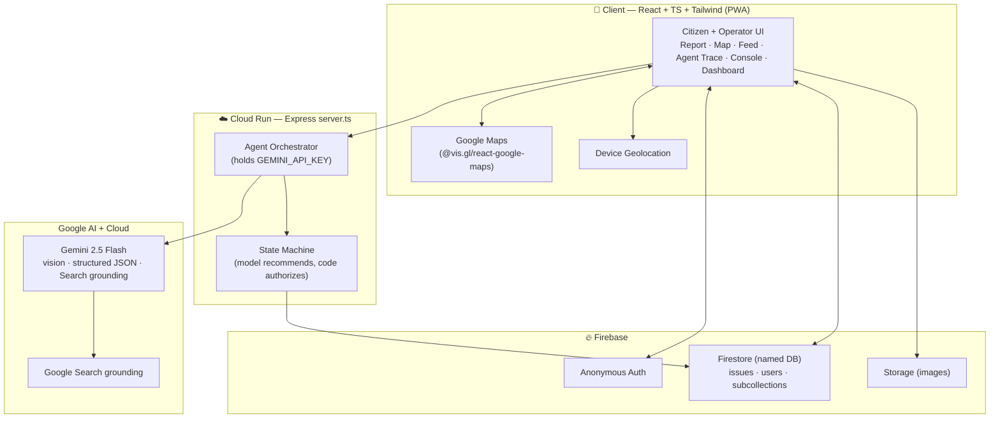
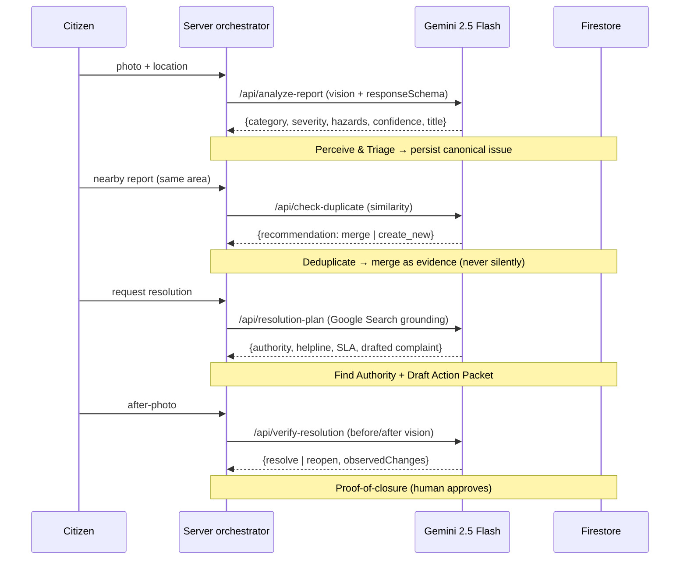
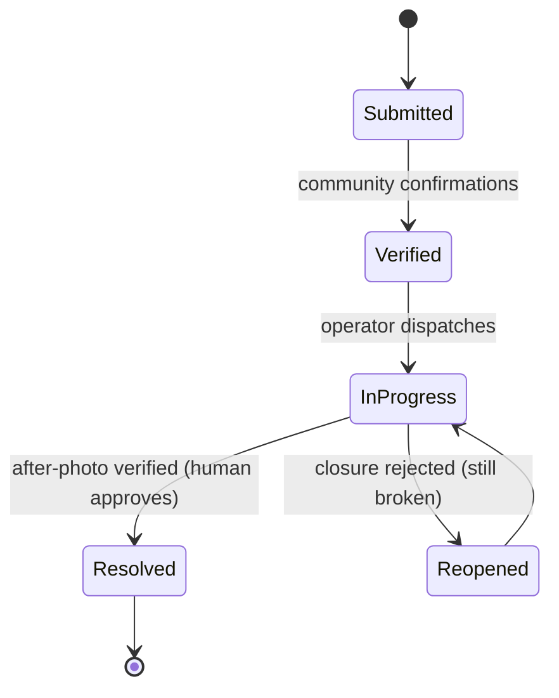

# CivicLens — Architecture

> From a citizen's photo to a verified resolution — one canonical, deduplicated, community‑verified case, kept accountable through closure.

CivicLens is a full‑stack React + TypeScript app built and deployed with **Google AI Studio** to **Cloud Run**. A server‑side orchestrator runs a multi‑step **agentic loop** powered by **Gemini 2.5 Flash** (vision, structured output, and Google Search grounding). A deterministic **state machine** owns all state transitions — *the model recommends, server code authorizes.*

---

## 1. System overview



**Why a server tier at all?** The Gemini API key must never reach the browser, and the agent must run controlled tools and authorize state changes deterministically. The client renders and reads/writes Firestore (guarded by security rules); every AI call and every state transition goes through the server.

---

## 2. The agentic loop

The signature feature is a **visible Agent Trace** — every step the agent takes is persisted and shown in the UI, so the intelligence is auditable rather than a black box.



### Agent endpoints (all `gemini-2.5-flash`)

| Endpoint | Role | Gemini technique |
|---|---|---|
| `POST /api/analyze-report` | Evidence triage from the photo | Vision + `responseSchema` (structured JSON) |
| `POST /api/check-duplicate` | Geo‑deduplication similarity | Structured JSON |
| `POST /api/resolution-plan` | Find the **real** authority + SLA + draft complaint | **Google Search grounding** (`tools: [{ googleSearch: {} }]`) |
| `POST /api/verify-resolution` | Before/after proof‑of‑closure | Vision + `responseSchema` |
| `POST /api/escalation` | Auto‑escalation letter + RTI petition draft | `responseSchema` |
| `GET /health`, `GET /api/health` | Liveness / warm‑up | — |

Each step appends an entry to the issue's **Agent Trace** (`{ step, tool, status, rationale, ts }`) covering: `Perceive → Locate → Deduplicate → Find Authority → Draft Action Packet` (+ `Verify Closure`, `Escalate` at those stages).

---

## 3. Data model (Firestore, named database)

```
issues/{issueId}
  ├─ canonical fields: ticketId, category, title, summary, severity,
  │   urgency, status, lat/lng, locationName, confidence, visibleHazards,
  │   priorityScore, reportCount, citizenUpvotes, confirmCount, disputeCount,
  │   verificationStatus, agentTrace[], resolutionPlan, escalation, isDemoData
  ├─ evidence/{id}        — every raw report kept attributable after a merge
  ├─ verifications/{uid}  — one confirm/dispute per user
  └─ activity/{id}        — audit log (Citizen / CivicLens Agent / Operator events)

users/{uid}               — anonymous profile
```

**Canonical issue graph:** when a second citizen reports the same problem nearby, CivicLens does not create a duplicate — it **merges** the new report into the existing canonical issue as `evidence`, incrementing `reportCount` while preserving every raw report. Ten reports become one accountable case, not ten ignored ones.

---

## 4. Server‑owned state machine

The model never mutates state directly. It returns a *recommendation*; deterministic server code authorizes the transition.



A separate **operator console** (second persona) works a priority‑sorted queue, advances status, and approves closures — every action written to the `activity` audit log.

---

## 5. Deterministic priority score

Computed in code (not by the model) and unit‑tested, so ranking is explainable and reproducible:

```
score = severity·12
      + urgency bonus
      + min(ageHours / 12, 10)          // older issues rise
      + min(confirmations · 3, 15)      // community weight
      + multi-report (dedup) weight
      − dispute penalty
```

The issue detail page shows this as an **itemized breakdown**, so a judge can see exactly why an issue ranks where it does.

---

## 6. Tech stack & Google technologies

| Layer | Technology |
|---|---|
| Build + Deploy | **Google AI Studio** → **Cloud Run** (asia‑southeast1) |
| Frontend | React + TypeScript + Tailwind v4, installable **PWA** (manifest + maskable icons + themed status bar + safe‑area) |
| AI | **Gemini 2.5 Flash** — multimodal vision, structured output (`responseSchema`), **Google Search grounding** |
| Backend | Node/Express (`server.ts`) on Cloud Run |
| Data/Auth/Files | **Firebase** — Anonymous Auth, Firestore (named DB), Storage |
| Maps | **Google Maps Platform** via `@vis.gl/react-google-maps` + device geolocation |

---

## 7. Security model

- **Secrets server‑side only.** `GEMINI_API_KEY` lives on the Cloud Run server; it is never in the client bundle. `firebase-applet-config.json` is the *public* Firebase web config (safe by design).
- **Firestore rules** enforce auth + ownership + invariants: reads require sign‑in; `create` requires `userId == auth.uid`, `status == 'Submitted'`, bounded `citizenUpvotes`, `reportCount == 1`, and a key‑count cap; `update` may not change `userId`/`ticketId`; real reports are non‑deletable (only `isDemoData` docs may be cleared).
- **Human oversight** on every consequential action — merges, routing, and closures are recommended by AI but approved by a person.
- **Graceful fallbacks** — Gemini timeout → retry/manual form; geolocation denied → manual pin + Bengaluru fallback; map denied → manual address.

---

## 8. Prototype boundary (stated honestly)

Government filing/routing is simulated via the operator console (clearly labeled), and the map ships with **clearly badged sample data** for demonstration. All AI reasoning — triage, deduplication, grounded authority lookup, complaint/RTI drafting, and before/after verification — is real.
